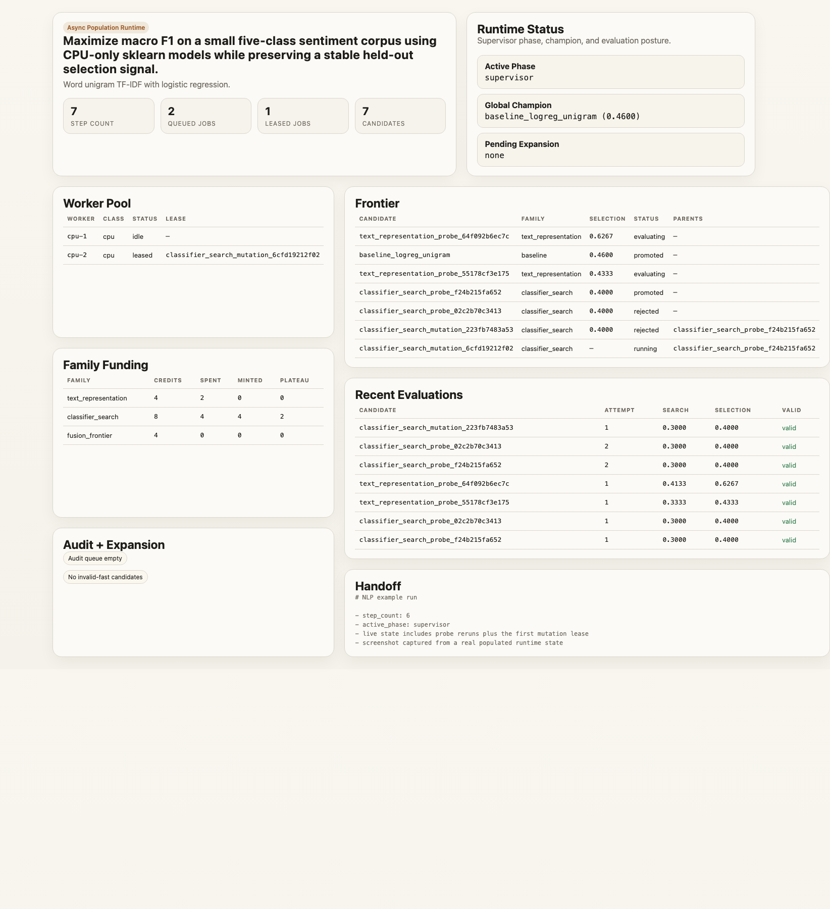

# labrat

`labrat` is a local-first research runtime for Claude Code and Codex.

It treats research as a shared candidate population with family funding, asynchronous workers, and external consistent evaluation.



## Core ideas

- **Async population search**: no global cycle barrier; workers keep evaluating descendants as soon as slots free up.
- **Funding over families**: credits are minted by stable, reproducible progress and spent on new descendants.
- **Consistent external evaluation**: workers produce artifacts, not authoritative verdicts.
- **Supervisor + worker model**: the agent supervises the runtime, while probe / mutation / crossover / audit workers execute bounded tasks.
- **File-as-Bus workspace**: durable files and append-only logs carry state forward so the supervisor can keep thin control over thick project state.

## A useful framing

`labrat` is not a philosophy-of-science engine, but Lakatos is a useful mental model for the runtime.

Stay inside a family while it is still producing real signal. Escalate to audit or frame break when local repairs stop paying for themselves. In Lakatos's terms, a programme [“is progressive if it is both theoretically and empirically progressive, and degenerating if it is not”](https://plato.stanford.edu/archives/fall2020/entries/lakatos/).

That is close to the `labrat` search ladder:

- cheap probes and mutation test whether the current family is still progressive
- implementation audit checks whether the failure is in execution rather than in the family itself
- frame break and expansion happen when local search is no longer earning the right to continue

## Quick evaluation path

Start with the flagship example:

```bash
python -m venv .venv
source .venv/bin/activate
pip install -r examples/nlp-sentiment/requirements.txt
cd examples/nlp-sentiment/research_lab
python scripts/bootstrap.py
python -m http.server 8787
python scripts/operator_helper.py status
python scripts/operator_helper.py next-prompt --runner claude --phase auto
```

Use `--runner codex` for Codex.

## Create a new lab

The default path is deep research first.

```bash
python scripts/new_lab.py my_lab
cd my_lab
python scripts/operator_helper.py next-prompt --runner claude --phase design
python scripts/operator_helper.py check-readiness
python scripts/bootstrap.py
python -m http.server 8787
python scripts/operator_helper.py next-prompt --runner claude --phase auto
```

Phase 0 must produce:

- `branches.yaml`
- `dead_ends.md`
- `research_brief.md`
- `research_sources.md`
- `evaluation.yaml`
- `runtime.yaml`

## Runtime model

The authoritative runtime state is:

- `state/runtime.json`
- `state/candidates.jsonl`
- `state/jobs.json`
- `state/workers.json`
- `state/evaluations.jsonl`
- `state/frontier.json`
- `state/checkpoints.jsonl`

The runtime uses:

- temperature-scaled steady-state dispatch
- family credits instead of isolated branch budgets
- rerun / stability checks before promotion
- audit routing for invalid-fast or unstable near-miss candidates
- frame break only after cheap probes and audits no longer justify more local search

## Required scaffold files

Every new lab now includes:

- `evaluation.yaml`
- `runtime.yaml`
- `coordination/workspace_map.md` after bootstrap
- `coordination/prioritized_tasks.md`
- `coordination/implementation_log.md`
- `coordination/experiment_log.md`
- `orchestrator.md`
- `probe_worker.md`
- `mutation_worker.md`
- `crossover_worker.md`
- `implementation_audit.md`
- `frame_break.md`
- `expansion_scout.md`
- `agent_prompts/`

`run_experiment.py` produces artifacts and metrics.

`evaluator.py` is the only canonical source of:

- `search_eval`
- `selection_eval`
- `final_eval`

## UI

The tracked UI is the static dashboard at `templates/dashboard.html`.

It is now runtime-centric:

- worker pool health
- queue depth
- family funding
- candidate frontier
- audit queue
- expansion state

## Clean break

This is a runtime overhaul.

- old cycle-based labs are not supported without re-scaffolding
- the static dashboard is the required UI surface
- no hosted control plane or database is required

## Repo map

- `program.md`: repo-level entrypoint
- `docs/getting-started.md`: practical startup flow
- `docs/runners.md`: Claude Code and Codex usage
- `docs/DEEP_RESEARCH.md`: design guidance for real labs
- `docs/ARCHITECTURE.md`: runtime model
- `scripts/runtime.py`: queue, lease, complete, reap, summary
- `scripts/evaluator.py`: external consistent evaluator
- `examples/nlp-sentiment/research_lab`: canonical example lab
