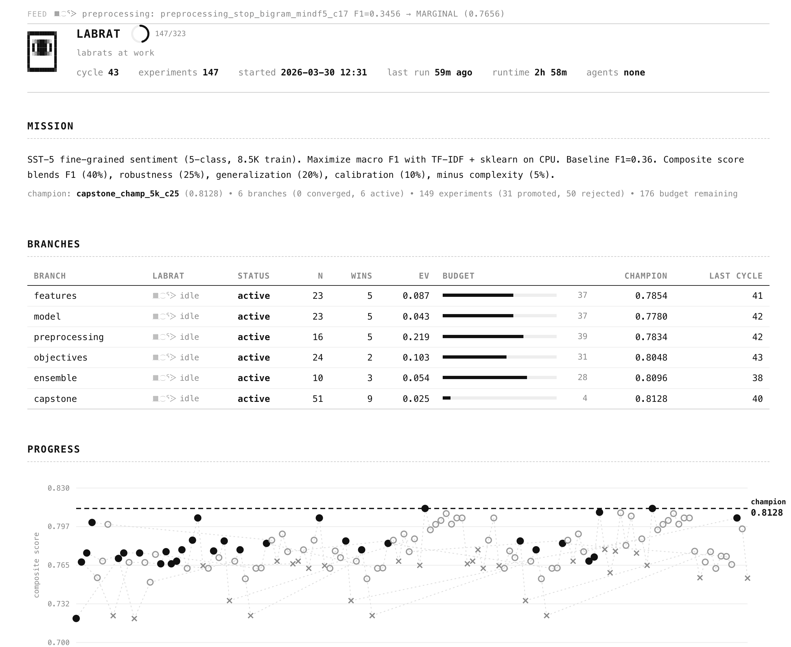

# labrat

An autonomous research lab that explores multi-branch research trees in parallel, using an economic funding mechanism to prioritize across competing trajectories. Productive branches earn more compute. Dead branches get defunded. The system converges on what actually works without manual steering.



A recent approach we've been using at [DXRG](https://dxrg.ai) to expand autoresearch into more exploratory domains. When you're trying to get a grounding across the full surface area of a problem -- not just optimize one metric on one axis -- you need something that can run many branches simultaneously and figure out which ones are worth funding. This is that.

Extends [Karpathy's autoresearch](https://github.com/karpathy/autoresearch) from single-agent single-metric to multi-branch market allocation across a full research tree.

No framework. No SDK. Markdown, JSON, YAML, and your existing eval pipeline.

Built to run inside coding agents. We've used [Claude Code](https://docs.anthropic.com/en/docs/claude-code) for all our runs. Works with Codex, OpenClaw, or anything that can read markdown, run shell commands, and write files.

## How it works

The orchestrator reads state, picks branches, and dispatches labrats (subagents) to run experiments in parallel. A mechanical formula scores results. Budget flows to branches that produce. Repeat until convergence.

```
  orchestrator.md
  │
  ├─ 1. Read state, select N branches by priority
  ├─ 2. Generate N experiments (one per branch, single delta)
  ├─ 3. Dispatch labrats IN PARALLEL ──────────────────┐
  │       ├── ᘛ⁐ᕐᐷ~ features: run + judge             │
  │       ├── ᘛ⁐ᕐᐷ~ model: run + judge                 │ concurrent
  │       └── ᘛ⁐ᕐᐷ~ objectives: run + judge            │
  ├─ 4. Collect results ◄──────────────────────────────┘
  ├─ 5. Score mechanically (formula, not LLM judgment)
  ├─ 6. Update state, beliefs, budget
  └─ 7. Write handoff for next cycle

  Every 5th cycle: red team (shuffled labels)
  Every 10th cycle: budget replenishment
  Stuck branches: research scout searches for new approaches
```

The AI decides **what** to try. A formula decides **if it worked**. Budget decides **what gets more compute**.

## Why markets

Research programs fail two ways: branches churn without converging, or the whole program over-invests in one direction. Markets solve both.

Each branch starts with compute credits. Experiments cost credits. Branches that improve earn bonus credits. Branches that don't get starved. The allocator is UCB1-inspired:

```
priority = 0.3 * expected_value + 0.4 * uncertainty + 0.3 * recency
```

High-uncertainty branches get explored early. Productive branches get revisited. Stale branches get forced. Natural transition from breadth-first exploration to depth-first exploitation.

## For agents

This repo is written for you. If a user pointed you here, your job is to set up and run a research lab for their problem. Here's what to do:

**If the user hasn't given you a problem yet**, ask them these questions in order:

1. "What problem are you trying to solve? What's your current baseline and what metric do you care about?"
2. "What constraints do you have?" (compute, time, dataset size, latency requirements)
3. "Do you have recent papers or prior experiments I should know about?"
4. "Do you have an existing eval pipeline, or should I build one?"

**Once you have the problem**, the workflow is:

1. **Design the tree** -- Use a deep research model (GPT-5.4 Pro or Claude with extended thinking if available, otherwise any strong reasoning model) to map the full problem space. Ask it for branch taxonomy, search spaces, scoring formula, and dead ends. Then convert the output to `branches.yaml`. You can use a second model to do the conversion if the first one outputs prose.

2. **Build the lab files** -- Create `run_experiment.py` (wraps the user's eval pipeline), `constitution.md` (scoring rules), `dead_ends.md` (known failures). Copy `orchestrator.md` from templates.

3. **Check in with the user** -- Show them what you've designed: "Here's the tree with N branches and M total budget. The scoring formula weights [metric] at X%, robustness at Y%. The experiment runner does [this]. Ready to start?" Get their approval before running anything.

4. **Bootstrap and run** -- `python scripts/bootstrap.py`, start the dashboard, enter the `/loop`. From here you follow `orchestrator.md` exactly. It has everything: what to read, how to score, when to do red team checks, how to handle stuck branches, when to stop.

5. **Report back** -- When the lab converges (or when the user checks in), summarize what was found: which axes matter, which are flat, what the production champion is, what surprised you.

Everything you need is in `templates/orchestrator.md`. That file IS your brain during the loop. A fresh agent with no prior context can read it and execute a full cycle.

## Setup (for humans)

There are two phases: designing the research tree (one-time, with a frontier model) and running the lab (autonomous loop).

### Phase 1: Design the research tree

Use a deep research model to design your branch structure. GPT-5.4 Pro or Claude with extended thinking work well if you have access -- any model with strong reasoning and broad domain knowledge will do. The goal is a comprehensive map of the problem space, not to run experiments yet.

Give the model your problem, baseline, constraints, and any recent papers. Ask for:
- Branch taxonomy (5-8 branches covering different axes of variation)
- Concrete search spaces per branch (specific values to try, not vague suggestions)
- A scoring formula (what metrics matter, how to weight them)
- Known dead ends from the literature (what not to waste compute on)
- Expected branch interactions (what to combine in the capstone)

Then convert to YAML. The conversion is mechanical -- map each suggestion to a `delta_key` + `values` pair:

```yaml
mission: "Maximize macro F1 on 5-class sentiment. Baseline: TF-IDF+LR F1=0.36. Target: F1 >= 0.42."

production_baseline:
  experiment_id: "baseline_v1"
  config:
    model:
      type: "logistic"
    features:
      max_features: 10000

branches:
  architecture:
    initial_budget: 25
    search_space:
      - delta_key: "model.type"
        values: ["svm", "catboost", "random_forest"]
  features:
    initial_budget: 20
    search_space:
      - delta_key: "features.ngram_max"
        values: [2, 3]
```

See the [NLP sentiment example](examples/nlp-sentiment/README.md) for a full walkthrough including raw frontier model output and how it was converted.

### Phase 2: Set up and run the lab

**1. Create your experiment runner** (`research_lab/scripts/run_experiment.py`):

The only file that touches your actual code. Accepts a config, trains, evaluates, returns metrics:
```python
def run_experiment(config):
    model = train(config)
    metrics = evaluate(model)
    return {
        "experiment_id": config["experiment_id"],
        "metrics": {"test": {"primary_metric": metrics.f1, "p_value": perm_test()}},
        "cv_folds": [{"fold": 0, "primary_metric": 0.85}, ...],
        "config": config,
    }
```

**2. Copy and customize templates**:
```bash
cp templates/orchestrator.md research_lab/
cp templates/constitution.md research_lab/    # scoring formula -- adjust weights for your domain
cp templates/dead_ends.md research_lab/       # add dead ends from your frontier model output
```

**3. Bootstrap and run**:
```bash
cd research_lab
python scripts/bootstrap.py
python -m http.server 8787 &
```

Then tell your agent:
```
Read research_lab/orchestrator.md and execute one research cycle.
Follow the 8 steps exactly. Do not ask for permission.
```

For continuous operation:
```
/loop 10m Read research_lab/orchestrator.md and execute one research cycle.
Follow the 8 steps exactly. Do not ask for permission.
```

Walk away. Watch it live at `http://localhost:8787/dashboard.html`.

## What you get

- **Market allocation** -- productive branches earn compute, dead branches starve
- **Parallel labrats** -- subagents explore multiple branches per cycle concurrently
- **Live dashboard** -- score timeline, branch leaderboard, experiment verdicts, labrat status
- **Mechanical scoring** -- formula not LLM judgment, prevents evaluation drift over long runs
- **Single-delta experiments** -- one change per experiment, clean causal attribution
- **Red team** -- shuffled-label integrity checks every Nth cycle
- **Research scouts** -- stuck branches trigger internet search for new approaches
- **Dead ends registry** -- structured memory of what failed, saves 10-20% compute
- **Budget economics** -- credits can map to real costs (GPU hours, dollars)

## Example: NLP Sentiment on SST-5

The **[examples/nlp-sentiment/](examples/nlp-sentiment/)** directory is a fully runnable lab. CPU-only, ~3 seconds per experiment, 43 cycles, 147 experiments.

| What the labrats found | Evidence |
|----------------------|---------|
| class_weight=balanced is the only thing that matters | +11% relative F1, biggest single delta |
| 5K features beats 10K and 20K | Smaller vocab reduces overfitting on 8.5K training samples |
| Bigrams capture negation | "not good" becomes a feature |
| SVM beats all tree models | Linear methods win on sparse TF-IDF |
| 9 axes are flat | max_features, sublinear_tf, trigrams, C, min_df, max_df, all trees |

3 axes that matter. 9 proven flat. Production champion: F1=0.398 (vs 0.360 baseline). See the [full writeup](examples/nlp-sentiment/README.md).

## Docs

- **[Getting Started](docs/getting-started.md)** -- Detailed setup guide
- **[Architecture](docs/ARCHITECTURE.md)** -- Three layers, parallel execution, dashboard, research scouts
- **[Workplan](docs/WORKPLAN.md)** -- 5-phase plan with timeline and cost estimates
- **[Economics](docs/economics.md)** -- Abstract mode vs cost-aware mode
- **[Domains](docs/domains.md)** -- Adapting to NLP, vision, RL, trading, drug discovery
- **[Runners](docs/runners.md)** -- Claude Code, Cursor, cron+API, GitHub Actions
- **[Visual Identity](docs/labrats-visual-guide.md)** -- The monolith, the rats, the aesthetic

## File structure

```
research_lab/
├── orchestrator.md         # The brain (copy from templates/)
├── constitution.md         # Scoring formula
├── branches.yaml           # Research tree + mission statement
├── dead_ends.md            # Known failures
├── dashboard.html          # Live monitoring (serve with python -m http.server)
├── scripts/
│   ├── run_experiment.py   # YOUR eval harness wrapper
│   ├── judge.py            # Mechanical scoring
│   ├── batch_runner.py     # Burn through many cycles fast
│   └── bootstrap.py        # State initialization
├── state/
│   ├── cycle_counter.json
│   ├── branch_beliefs.json
│   ├── champions.json
│   ├── budget.json
│   ├── experiment_log.jsonl
│   └── active_agents.json  # Labrat status (dashboard reads this)
├── experiments/            # Per-branch experiment results
└── logs/
    ├── handoff.md          # What happened, what's next
    └── cycles/             # Per-cycle JSON records
```

## Credits

Inspired by [Karpathy's autoresearch](https://github.com/karpathy/autoresearch). Extended with market-based multi-branch allocation, parallel labrat agents, and live dashboards. Built with [Claude Code](https://docs.anthropic.com/en/docs/claude-code) at [DXRG](https://dxrg.ai).

MIT license.
