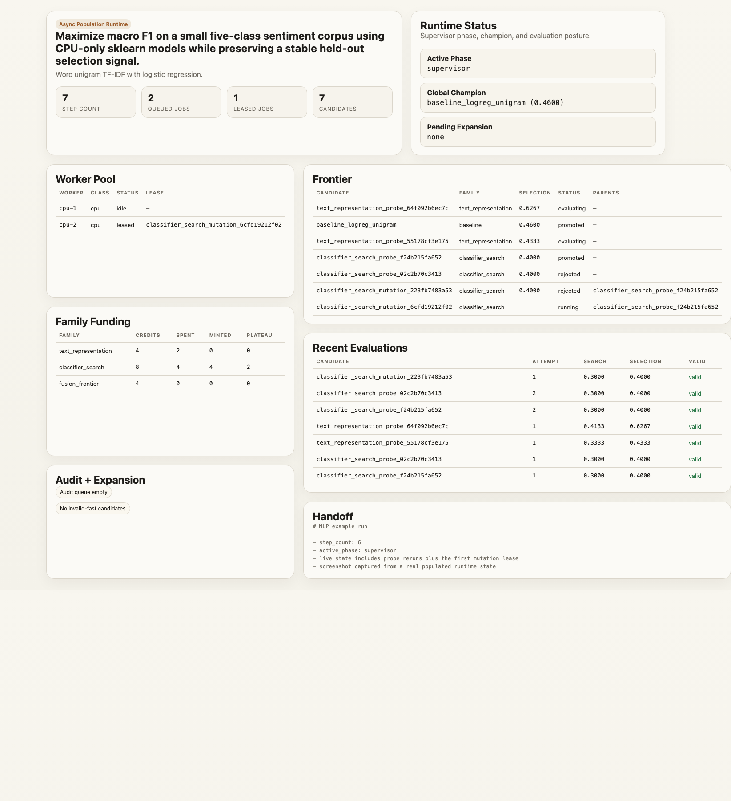

# labrat

[English](README.md) | [简体中文](README.zh-CN.md)

`labrat` is a local-first runtime that puts Claude Code or Codex on a real research problem with a scoreboard and enough structure to run for hours. Population search, not single-thread: families of ideas compete for compute budget, and the ones that produce real signal earn more room to keep going.



<sub>Live example run: the baseline still leads on the main selection metric, while `classifier_search` has already won two decisive held-out challenges and earned extra funding.</sub>

`labrat` treats Claude Code and Codex as peer operator interfaces. Stronger reasoning models still help most on synthesis, audit, and consolidation, but the runtime contract and file layout stay the same across both.

**Jump to** → [Run it in 5 minutes](#run-it-in-5-minutes) · [Start from a profile](#start-from-a-profile) · [Build a corpus](#build-a-corpus) · [Compile it](#compile-it-into-something-executable) · [Create your own lab](#create-your-own-lab-from-scratch) · [Why it exists](#why-it-exists)

In plain English:

- you define a problem and a baseline
- the agent explores multiple families of ideas
- the runtime keeps the queue moving
- the evaluator scores results consistently
- families gain real status by winning hard held-out challenges, not just by overfitting the local hill-climb

## Why it exists

- **Async population search**: no global cycle barrier; workers keep evaluating descendants as soon as slots free up.
- **Funding over families**: credits are minted by stable, reproducible progress and spent on new descendants.
- **Consistent external evaluation**: workers produce artifacts, not authoritative verdicts.
- **Supervisor + worker model**: the agent supervises the runtime, while probe / mutation / crossover / audit workers execute bounded tasks.
- **File-as-Bus workspace**: durable files and append-only logs carry state forward so the supervisor can keep thin control over thick project state.
- **Decisive challenges**: a family earns extra status when it wins a held-out challenge that was not already baked into the local search metric.

This means a family can become strategically important even before it becomes the global selection champion. The dashboard now shows both the current champion and the current decisive-challenge leaders.

## Good first problems

`labrat` works best when the problem has:

- a clear baseline
- a bounded experiment runner
- a metric you can score consistently
- at least one harder held-out challenge beyond the main hill-climb metric

Good examples:

- tune a small classifier or ranking model
- iterate on prompt + rubric combinations with fixed evaluation
- search over retrieval / reranking strategies
- compare workflow variants where one family should win a specific hard slice, not just the average score

If you only open three things first:

- [program.md](program.md)
- [examples/nlp-sentiment/research_lab](examples/nlp-sentiment/research_lab)
- [docs/DEEP_RESEARCH.md](docs/DEEP_RESEARCH.md)

## A useful framing

`labrat` is not a philosophy-of-science engine, but Lakatos is a useful mental model for the runtime.

Stay inside a family while it is still producing real signal. Escalate to audit or frame break when local repairs stop paying for themselves. In Lakatos's terms, a programme [“is progressive if it is both theoretically and empirically progressive, and degenerating if it is not”](https://plato.stanford.edu/archives/fall2020/entries/lakatos/). In `labrat`, that means a family should not only improve the known metric, but also win a decisive held-out test that rivals do not already own. More on that in [docs/DEEP_RESEARCH.md](docs/DEEP_RESEARCH.md).

## Run it in 5 minutes

Start with the flagship example:

```bash
python -m venv .venv
source .venv/bin/activate
pip install -e '.[nlp-sentiment]'
labrat doctor --lab-dir examples/nlp-sentiment/research_lab
labrat bootstrap --lab-dir examples/nlp-sentiment/research_lab
python -m http.server 8787 --directory examples/nlp-sentiment/research_lab
labrat status --lab-dir examples/nlp-sentiment/research_lab
labrat next-prompt --lab-dir examples/nlp-sentiment/research_lab --runner claude --phase auto
```

Use `--runner codex` for Codex.

The editable install is intentional: the `labrat` CLI keeps using the templates, profiles, and scripts from this checkout. If you prefer the original in-lab workflow, the copied `scripts/*.py` entrypoints still work unchanged inside each lab.

What you get from the example:

- a running dashboard
- a fully scaffolded lab
- held-out decisive challenges on top of search / selection metrics
- a reference supervisor + worker flow that you can copy into a new lab

## Agent interfaces

`labrat` does not depend on hidden local skills, private prompts, or machine-specific setup. The operator contract ships in the repo and in every generated lab:

- repo root: `AGENTS.md` for Codex, `CLAUDE.md` for Claude Code
- each lab: `AGENTS.md`, `.agents/skills/`, `CLAUDE.md`, `.claude/commands/`, and `agent_prompts/`
- shared runtime surface: `labrat ...` from the repo root or `python scripts/...` inside a lab

That means a user can clone the repo, open either Codex or Claude Code, and operate the lab from files that are already present in version control. Codex can optionally load the checked-in `labrat-operator` skill, but no hidden local skill file is required.

## Start from a profile

If you already know the shape of your research problem, a profile scaffolds a runnable lab in one command. No Phase 0 hand-editing, no `LABRAT_PLACEHOLDER` stubs.

```bash
labrat new ~/labs/my_search --profile=transformer-arch
cd ~/labs/my_search
python -m pip install -r requirements.txt
labrat doctor --lab-dir .
labrat check-readiness --lab-dir .
labrat bootstrap --lab-dir .
```

### Operator surfaces

Every lab, whether profile-scaffolded or hand-built, ships both primary operator surfaces:

- `AGENTS.md` for Codex
- `.agents/skills/labrat-operator/SKILL.md` for the optional Codex workflow
- `CLAUDE.md` plus `.claude/commands/` for Claude Code
- `agent_prompts/` for the shared phase prompts consumed by either interface

The Claude Code slash commands are short markdown files that wrap common operator actions so you do not have to remember the CLI invocations:

- `/next` — print the prompt for the current phase and execute it.
- `/why-stuck` — diagnose a stalled frontier from `state/frontier.json` and recent evaluations.
- `/synthesize` — summarise the last ~10 evaluations before dispatching more work.
- `/audit-candidate` — walk the highest-signal suspicious candidate through the audit worker.
- `/frame-break` — propose a structural pivot once cheap probes and audits are exhausted.
- `/consolidate` — write a compact checkpoint note to `logs/checkpoints/`.

Open Claude Code in the lab directory and type `/next`, or hand-run `python scripts/operator_helper.py next-prompt --runner claude --phase auto`. In Codex, read `AGENTS.md` and run `python scripts/operator_helper.py next-prompt --runner codex --phase auto`.

### Available profiles

- `transformer-arch` — tiny character-level transformer architecture search with held-out-distribution decisive challenges. Ships a synthetic runner so you can exercise the full runtime loop without a training framework; replace `scripts/run_experiment.py` with your own trainer when you want real training.
- `quant-finance-corpus` — bibliography network mapping and rights-tagged corpus assembly. Candidates are scouting policies rather than models, and the decisive challenges are cross-domain bridge discovery and rights clearance. See [Build a corpus](#build-a-corpus).
- `dxap-knowledge` — the executable bibliography: compiled concept, hypothesis, method and decision-relevance cards, plus filtered retrieval. Candidates are retrieval policies; decisive challenges are correct abstention and counterevidence coverage. Stacks on `quant-finance-corpus`. See [Compile it into something executable](#compile-it-into-something-executable).

More profiles (world-model, multi-dataset) land in follow-up PRs. See [docs/PROFILES.md](docs/PROFILES.md) for the profile contract and [docs/LONG_HORIZON.md](docs/LONG_HORIZON.md) for interim-checkpoint and long-running-job conventions.

## Build a corpus

`labrat corpus` is a second use of the same runtime: instead of searching over model configurations, it searches over *what to read next*. It maps a literature as a citation network, expands it in bounded rounds until each area stops yielding, and tags every item with its form and its rights.

```bash
labrat new ~/labs/my_corpus --profile=quant-finance-corpus
cd ~/labs/my_corpus
python scripts/corpus.py status                      # coverage, rights posture, saturation
python scripts/corpus.py frontier --limit 15         # what to look for next, and why
python scripts/corpus.py round open --mode expand --bucket market_microstructure
# read corpus/rounds/round-001/request.md, research, fill in findings.yaml
python scripts/corpus.py round close
python scripts/corpus.py manifest                    # the rights-gated build list
```

Three things make it more than a reading list:

- **The frontier is computed.** References to works you have not catalogued yet become ranked targets, scored by co-citation support, the citing works' priority, and how far the bucket is from its page target.
- **Rights are first-class.** Every entry carries a form tag and a rights status with an evidence URL and a check date. Nothing reaches the manifest without `confidence: confirmed` plus evidence — free-to-read is not licensed, and a purchase is not a clearance.
- **Saturation is the stopping rule.** A bucket is done when two consecutive expansion rounds add nothing new and its frontier is empty. "Exhaustive" means saturated, not a fixed round count.

The bundled profile seeds 173 works across market microstructure, quantitative finance, information economics, signal processing, detection and tracking, control, operations research, queueing, information theory, Bayesian statistics, sequential decision theory, dynamical systems, network science, exchange documentation, open courseware and practitioner training. Every seed rights tag is `inferred`, so the seed clears nothing until someone reads a licence.

See [docs/CORPUS.md](docs/CORPUS.md) for the data model, the tagging vocabularies, and how to point the engine at another domain.

## Compile it into something executable

A corpus is a means, not the goal. `labrat` also ships the layer that turns sources into objects an agent can act on and check:

```
source -> mechanism -> assumptions -> observable signature
       -> deterministic test -> decision relevance -> realized outcome
```

```bash
labrat new ~/labs/my_dxap --profile=quant-finance-corpus --profile=dxap-knowledge
cd ~/labs/my_dxap
python scripts/knowledge.py validate                 # the SERVABLE gate over every card
python scripts/knowledge.py evaluate                 # score retrieval policies against labelled trials
python scripts/knowledge.py retrieve --context ctx.json --policy decision_value --markdown
python scripts/methods.py self-test                  # every method's closed-form checks
```

A passage tells an agent that order flow may contain information. A concept card tells it under what assumptions that holds, which observables separate informed from mechanical flow, which tested function to run on the data actually available, what would falsify it, and whether it bears on entry, sizing, exit or abstention.

Three things make this more than a vector database:

- **The SERVABLE gate.** A card is retrievable only with a mechanism, its assumptions, required observables, an expected signature, failure modes, counterevidence, and resolvable source anchors. No contradicting concept and no alternative explanation means the card does not serve — a retrieval layer that can only confirm is worse than none.
- **Structural filters before similarity.** Market type, horizon, observables actually available, decision type, and point-in-time source availability, so a 2025 book cannot inform a 2024 decision. Then a decision-value re-rank, diversity control, explicit abstention, and a one-hop expansion that must carry counterevidence.
- **Deterministic tools, not recalled arithmetic.** Eight versioned methods with as-of contracts and closed-form self-tests. Method bindings pin the implementation version, so a numerical change fails validation until someone re-verifies the card.

On the shipped seed, plain similarity retrieval scores a perfect hit rate — with precision 0.24, zero counterevidence, and an answer for *every* inapplicable context including one dated before its sources existed. It stays in the lab as the control arm.

See [docs/KNOWLEDGE.md](docs/KNOWLEDGE.md) for the object model, the retrieval pipeline, and the three gates that separate "the retrieval layer works" from "this makes money".

## Create your own lab from scratch

If no profile fits your problem, scaffold an empty lab and finish Phase 0 by hand. The default path is deep research first.

```bash
labrat new my_lab
cd my_lab
labrat doctor --lab-dir .
labrat next-prompt --lab-dir . --runner claude --phase design
labrat check-readiness --lab-dir .
labrat bootstrap --lab-dir .
python -m http.server 8787
labrat next-prompt --lab-dir . --runner claude --phase auto
```

Use `--runner codex` if you are operating from Codex instead of Claude Code.

Phase 0 must produce:

- `branches.yaml`
- `dead_ends.md`
- `research_brief.md`
- `research_sources.md`
- `evaluation.yaml`
- `runtime.yaml`

`evaluation.yaml` now includes at least one held-out `prediction_tests` challenge. That is how the runtime distinguishes “fit the known metric a bit better” from “this family actually predicted something hard.”

## Repo map

- [program.md](program.md): repo-level entrypoint
- [docs/getting-started.md](docs/getting-started.md): setup and first-run flow
- [docs/runners.md](docs/runners.md): Codex and Claude Code operator contract
- [docs/MODEL_GUIDANCE.md](docs/MODEL_GUIDANCE.md): frontier-model prompting, reasoning-effort, and research guidance
- [docs/CORPUS.md](docs/CORPUS.md): bibliography network mapping, iterative scouting rounds, and rights tagging
- [docs/KNOWLEDGE.md](docs/KNOWLEDGE.md): the executable bibliography — concept compilation, filtered retrieval, deterministic methods, and the attribution ledger
- [docs/ARCHITECTURE.md](docs/ARCHITECTURE.md): runtime, state, and evaluation details
- [docs/PROFILES.md](docs/PROFILES.md): profile mechanism and how to author a new one
- [docs/LONG_HORIZON.md](docs/LONG_HORIZON.md): `checkpoints.jsonl` contract, `failure_class` values, per-pool timeouts
- [docs/AUTONOMY.md](docs/AUTONOMY.md): permission allowlist, `/loop` cadence, stop criteria, cold-start recovery

## Background

`labrat` comes out of DXRG. We first used variants of this runtime internally to explore different financial world-model architectures and adjacent research workflows, then published the parts that generalized cleanly beyond that domain.

## References

`labrat` is its own system, but the current shape is informed by a few clear predecessors and adjacent designs:

- [karpathy/autoresearch](https://github.com/karpathy/autoresearch): the minimal agent-driven autonomous experiment loop that helped establish the basic pattern of fixed evaluation plus overnight iteration.
- [AIRA_2](https://arxiv.org/abs/2603.26499): population search, stronger evaluation discipline, and stateful operator quality as first-class system levers.
- [Toward Autonomous Long-Horizon Engineering for ML Research](https://arxiv.org/abs/2604.13018): hierarchical orchestration, File-as-Bus coordination, progressive disclosure, and thin control over thick state.
- [Stanford Encyclopedia of Philosophy: Imre Lakatos](https://plato.stanford.edu/archives/fall2020/entries/lakatos/): useful framing for when a family is still progressive versus when it has become degenerating and should escalate to audit or frame break.

<sub>English is canonical. The Chinese README is included for accessibility and may lag slightly behind.</sub>
